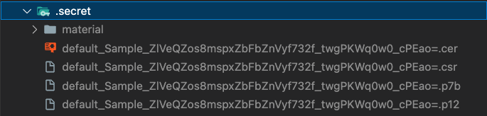

# oh-action
The `oh-action` is a GitHub Action that streamlines OpenHarmony development workflows by setting up the necessary development environment. It automatically installs the OpenHarmony SDK and provides essential command-line tools, enabling developers to build, test, and manage their OpenHarmony applications in CI/CD pipelines.

## Requirements
- macOS runner (`runs-on: macos-latest`)
- OpenHarmony project with valid structure
- Valid `hvigorw` file in project root

## Features
- 🚀 Automatically installs OpenHarmony (SDK v4.1)
- 🛠️ Sets up command-line tools including:
  - 📦 `ohpm` (OpenHarmony Package Manager) for dependency management
  - 🔨 `hvigorw` for building applications
  - 🔄 More tools coming soon!
- ⚙️ Configures the necessary environment variables and paths
- ✅ Validates project structure and requirements
- 📁 Supports custom working directories for monorepo setups

## Supported Versions
| OpenHarmony | SDK Version | ohpm | hvigor | Supported |
|-------------|-------------|------|--------|-----------|
| v4.1        | v11         | 1.4  | 3.2.4  | ✔         |

## Example Usage

``` yaml
name: Build OpenHarmony Application
on:
  push:
    branches:
      - main # Trigger workflow on push events to main branch
  pull_request:
    branches:
      - main # Trigger workflow on pull request events targeting main branch

jobs:
  build:
    runs-on: macos-latest
    steps:
      - name: Checkout code
        uses: actions/checkout@v4 
          
      - name: Setup OpenHarmony environment
      - uses: Snapp-Mobile/oh-action@v0.1

      - name: Install dependencies
        run: ohpm install --all

      - name: Build project
        run: |
          hvigorw --version --accept-license
          hvigorw clean --no-parallel --no-daemon
          hvigorw assembleHap --mode module -p product=default --stacktrace --no-parallel --no-daemon

```


## Inputs

| Input                 | Description                                         | Required | Default |
|---------------------  |-----------------------------------------------------|----------|---------|
| working-directory     | Working directory relative to repository root       | false    | "."     |
| install-dependencies  | Install dependencies using ohpm install --all       | false    | "true"  |


### using custom working directory
If your project is located in a subdirectory of the repository, you can specify the `working-directory` input to set the correct path. For example, if your project is located in the `app` directory, you can set the `working-directory` input as follows:

```yaml
name: Build OpenHarmony Application

# Default configurations for running commands in this workflow
# Every step in this workflow will run in the context of the working directory
defaults:
  run:
    working-directory: ./Sample

# Define when this workflow should run
on:
  push:
    branches:
      - main # Trigger workflow on push events to main branch
  pull_request:
    branches:
      - main # Trigger workflow on pull request events targeting main branch

jobs:
  build:
    runs-on: macos-latest # Use the latest version of macOS for this job

    steps:
      - name: Checkout code
        uses: actions/checkout@v4 # Checkout the repository content to the runner

      - name: Build Project Using oh-action
        uses: Snapp-Mobile/oh-action@main
        with:
          working-directory: ./Sample

      - name: Install dependencies
        run: ohpm install --all

      - name: Build project
        run: |
          hvigorw --version --accept-license
          hvigorw clean --no-parallel --no-daemon
          hvigorw assembleHap --mode module -p product=default --stacktrace --no-parallel --no-daemon
```

### Handling OpenHarmony Signing Materials Securely

When building OpenHarmony applications, you need various signing materials (certificates, profiles, and keystores) to package your application. Here's how to handle these sensitive files securely in your CI/CD pipeline:

#### 1. Organize Signing Materials

You can learn about how to create your own secret files from this link: [Creating Certificate and Key Files](https://developer.huawei.com/consumer/en/doc/harmonyos-guides/ide-signing-V13#section297715173233)

We decided to put our keys and other important files in the `.secret` folder in the root of our project. Also, don't forget to update your project structure to use these keys and files.




The `.secret` folder typically contains:
- `.cer` file: Developer certificate for signing
- `.p7b` file: Profile for app provisioning
- `.p12` file: Keystore containing private key


#### 2. Create Protected Archive
To create a secure, base64-encoded archive of your signing materials, follow these steps:

1. Navigate to the directory containing your `.secret` folder.
2. Run the following command to create a zip archive of the `.secret` folder:
   ```sh
   zip -r secrets.zip .secret
   ```
3. Encode the zip file to base64 and display it in the terminal:
   ```sh
   base64 secrets.zip
   ```
4. Copy the base64 string displayed in your terminal to your clipboard.

#### 3. Store in GitHub Secrets
1. Go to your repository's Settings > Secrets and variables > Actions
2. Create a new secret named `OH_SECRETS_ZIP`
3. Paste the `base64` string from your clipboard

#### 4. Use in Workflow
Add the following step to your workflow to securely extract signing materials:
``` yaml
- name: Setup OpenHarmony signing certificates and keystore
  run: |
    # Decode and extract signing materials
    echo "${{ secrets.OH_SECRETS_ZIP }}" | base64 -d > secrets.zip
    unzip -o secrets.zip
    rm secrets.zip
```

**Important Note:** Remember to add .secret/ to your .gitignore file to prevent accidentally committing sensitive files.

## Support

If you encounter any issues:
- 🐛 Open an issue in the GitHub repository
- 📝 Provide detailed error messages and logs
- 💻 Share your workflow configuration

## Contributing
Contributions are welcome! Please feel free to submit a Pull Request.

## License
This project is licensed under the Apache License, Version 2.0 - see the [LICENSE](LICENSE) file for details.
